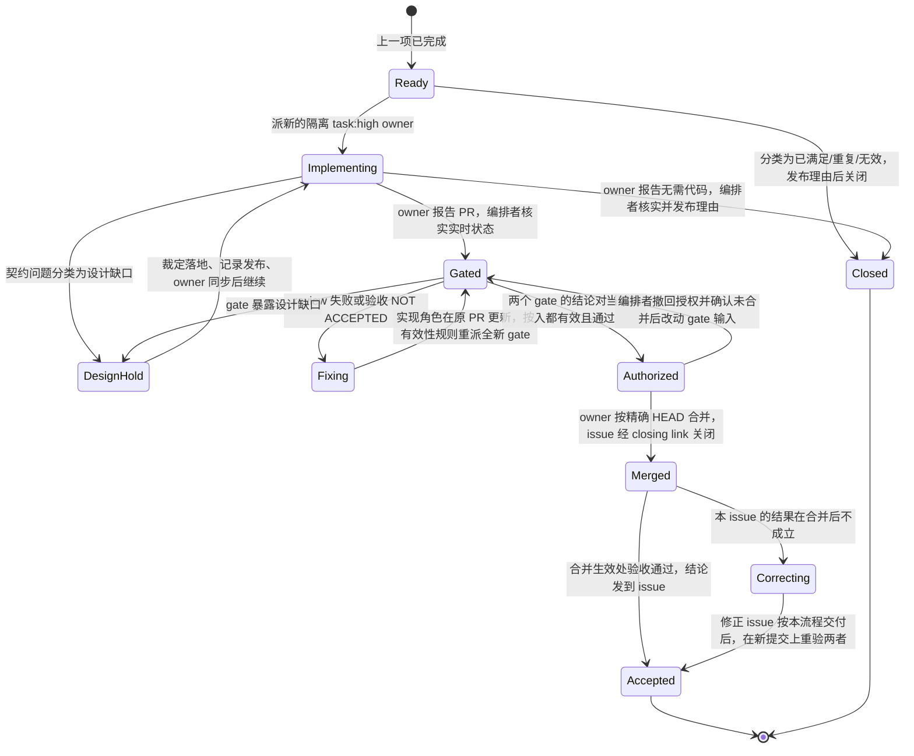

# delivering-issues

本 skill 把一组 issue 逐个推进到「PR 已合并、issue 已关闭、合并生效处验收通过」，或以有据可查的 no-code 理由关闭。它只规定编排：谁实现、谁审、谁验收、何时合并、设计缺口怎么裁、记录留在哪里。PR 正文与证据形式按 `skill://writing-pr`，review 的 gate 与裁决按 `skill://review-pr`，讨论位置按 `~/.claude/rules/github-issue-pr-routing.rule.md`，完整抓取按 `~/.claude/rules/gh-full-fetch-issues-prs.rule.md`，运行验证强度按 `~/.claude/rules/runtime-verification-required.rule.md`。

issue 从哪来——`writing-complex-issues` 产出的树、手写的列表、导入的工单、上个会话遗留——不改变任何步骤；它们可以有也可以没有 parent，可以分属不同 repo。每一项都按「逐项分类」核实实时状态，不因来源假定它尚未完成或必然需要代码。

## 分工

用户要求按本流程交付时，下表分工生效。这是用户对 `~/Ext/code/omp-config/agent/APPEND_SYSTEM.md` 默认分工的显式改写（依据其「User instructions take precedence」），只作用于这张表，其余规则照常适用。编排者自行匹配到本 skill 不构成这一改写；那种情况下先向用户呈报计划，由用户要求执行（见「输入与启动」第 5 步）。child 看不到对话、本 skill 和 appendix，每个 brief 都要写明这段分工（[references/briefs.md](references/briefs.md) 的共有块）。

| 角色 | 实例 | 负责 | 不做 |
|---|---|---|---|
| 编排者 | 当前会话 | 串行门禁；逐项分类；设计裁定；设计权威文件与 issue 契约的编辑；派审与验收；核实 gate 结论；合并授权；记录 | 实现代码与测试；替 owner 定实现方案；问用户 |
| 实现 owner | 每个 issue 一名新起的隔离 `task:high` | 该 issue 的全部实现（含核心代码）、测试、PR 与证据、修复、按授权合并；按自己的 system prompt 安排下级 subagent | 编辑设计权威文件；推进别的 issue；未经授权合并 |
| reviewer | 每轮一名全新的隔离 `task:mid`，用完即弃 | 在一个 HEAD 上执行 `review-pr` 的全部 Gate 1–5，把结论直接发到 PR thread | 改代码、补作者证据、合并 |
| 验收者 | 每次一名全新的隔离 `task:mid` | 在精确 HEAD 或合并生效处独立观察 issue 结果，向编排者报告 PASS / NOT ACCEPTED | 改代码、写 GitHub、合并 |
| 顾问 | `discuss:steady` + `discuss:divergent`、`mentor:default`；探针用 `task:low` / `task:mid` | 设计缺口的正反论证与事实取证 | 裁定、编辑文档 |

- APPEND_SYSTEM 里「亲自写核心、外围委派」等实现义务作用于 owner。编排者不以「核心应由我写」为由收回实现，也不因此停下来等上游改规则。
- **设计权威文件**：设计文档，以及设计文档或 umbrella 指定为契约源、且不在产品源码目录里的类型声明（例如 `spec/types/`）。只有编排者在裁定时编辑它们；issue 正文即使写着「组件内歧义由 child 在 PR 里写进所属章节」，owner 也改为上报编排者。契约源位于产品源码里时，编排者把裁定写进设计文档与 issue，类型改动由 owner 实现。调用方随契约迁移属于实现，归 owner。
- 没有指定设计文档的 issue，issue body 就是契约，裁定改写 body。
- 交付物只有设计权威文件的清单项，由编排者兼任 owner：亲自写文档、开 PR（`writing-pr` 纯文档模板）、按授权合并；review 与验收照常由全新的 `task:mid` 做。
- **reviewer 与 `review-pr` 的组合**：本 skill 的 reviewer 同时是 `review-pr` 的主审和执行层。它自己完成 Gate 5，不再派子代理；按用户要求把结论直接发到 PR thread，这一点改写 `review-pr`「执行层不创建 GitHub 对象」的限制。编排者保留两件事：核实已发布的发现，以及合并授权。
- 编排者可以用其他 task 档位调查、跑探针；调查不写进 repo，也不推进另一个 issue。

## 输入与启动

| 项 | 取得方式 |
|---|---|
| 执行清单 | 用户给出的有序列表；没给时取 parent/umbrella 的编排与依赖图，按依赖拓扑序、同层按编号排。umbrella 写着「可以同时开始」也照样串行 |
| 每个 issue 的目标 repo 与默认分支 | 该 issue 的 closing PR 所在 repo：通常是 issue 所在 repo；issue 正文指明代码在别处时以正文为准 |
| 设计权威 | issue 必读章节、umbrella 契约、目标 repo 的设计文档与契约类型；都没有时是 issue body |
| 设计记录位置 | 有 parent/umbrella 时用它；没有时用当前 issue |
| 策略原文 | `~/Ext/code/omp-config/agent/APPEND_SYSTEM.md` 全文，与当前 system prompt 的指定区块（见 briefs.md） |

1. 完整抓取 parent 与清单里每个 issue（body、全部 comment、图边与关联 PR），读各目标 repo 的 `AGENTS.md` / `CLAUDE.md` / rules，和各 issue 必读的设计章节全文。
2. 对每个 issue 做「逐项分类」的粗分。
3. `todo` 建全套：每个 issue 一项，有 parent 时再加一项「树关闭验证」。
4. 写中心计划（结构见「记录与恢复」），写完读回一次。
5. 用户只要求「安排」「计划」，或本 skill 是编排者自行匹配到的，停在这里汇报计划，等用户要求执行；用户已要求按本流程执行就直接进入第一项。开始之后不再向用户提问。

编排者和所有 child 都不在隔离工作区或编排者的工作 checkout 里改 repo，而是各自在 `/tmp/delivering-issues/<owner>-<repo>-<issue>/<agent 名>`（编排者的设计修改用 `.../design`）下基于远端提交另建 clone 或 worktree。这样隔离工作区保持原样，结束时没有补丁写回；owner 尚未推送的工作也留在一个可查的路径上。

### 逐项分类

轮到某项时按实时状态分流：

| 实时状态 | 处置 |
|---|---|
| open，没有关联 PR | 派 owner |
| open，已有本流程可维护的 PR（agent 账号所开、closing 指向本 issue） | 派 owner 或续作 owner 沿用该 PR |
| open，已有他人（人类或第三方）的 PR | 不改动其 branch；owner 另开 PR，编排者在旧 PR 留 comment 说明原因并链接新 PR |
| 已由合并的 PR 关闭 | 在默认分支当前最新提交上做合并生效处验收（§6 第 2 步）；通过即完成，结果不成立按 §6 第 3 步进入 `Correcting` |
| 已关闭，有持久的 no-code 理由 | 核实理由仍成立即完成；不成立则重新打开，再按本表分类 |
| 已关闭，没有合并 PR 也没有理由 | 重新打开，再按本表分类 |
| open，已满足、重复、无效或失去意义 | 编排者取证，按 `review-pr` Gate 6 在 issue 上发布持久理由后关闭 |

实现过程中 owner 报告「无需代码」或「需要拆分」时，编排者核实后分别走 no-code 关闭，或用 `writing-issue` 写出新 issue、改写当前 issue 的范围并把新 issue 按依赖插进清单。

## 单个 issue 的生命周期

任何时刻只有一个清单项处在 `Ready` 与 `Accepted`/`Closed` 之间；`Correcting` 里的修正 issue 属于当前项。同一 issue 内的 review 与验收可以并行，owner 的下级 subagent 也可以并行；不同清单项的实现不并行，也不为绕开当前项的未决点提前开下一个。

### 1. 派 owner

- 用 `task` 派，`agent: task:high`，`isolated: true`。不用 `fork_task`：fork 会让 owner 继承编排者的上下文与角色，owner 必须从空白开始，只凭 brief 工作。
- brief 按 briefs.md「实现 owner」模板写。策略原文在派工当时从文件和 system prompt 读出、逐字粘贴，不凭记忆改写。
- owner 从派出到合并确认一直负责该 PR。PR 就绪后它应保持在线，等 review 反馈与合并授权。向它发消息失败（已结束、不可恢复）时，派续作 `task:high`（模板「续作 owner」）接手同一 branch/PR，这是正常路径，不是异常；接手状态以远端 branch 和原 owner 工作目录（中心计划记下的 `/tmp/delivering-issues/...` 路径）里尚未推送的提交为准。
- 仍有补丁意外写回编排者的工作 checkout 时不动它，把路径记进中心计划，清单结束时列给用户。

### 2. 契约问题与设计缺口

owner、reviewer、验收者上报的契约问题，以及编排者核实 gate 发现时遇到的契约争议，先由编排者分类：

| 类 | 判据 | 处置 |
|---|---|---|
| 契约已答 | 现有章节的文字直接决定结果 | 引章节回复提问者；review 与验收照此判 |
| 输入越界 | 现象只在契约定义域外出现 | 引依据驳回候选缺陷，不要求改代码 |
| 实现缺陷 | 契约清楚，实现不符 | 按 review Gate 5 或验收失败处理，owner 修 |
| 验收方法不成立 | issue 的验收行在本层观察不到，或只能产出无意义证据（例如没有接入被测路径的 mock 计数） | 编排者修正 issue 契约：产品要求不变，只改观察方法；该义务移给能观察它的 issue 并当场写进其 body，没有这样的 issue 就用 `writing-issue` 新建并按依赖插进清单 |
| 设计缺口 | 契约沉默或自相矛盾，不同选择会改变可观察结果或迫使另一实现单元同步改变 | 属于后果性决策，走下面的裁定流程 |

裁定流程：

1. 告诉 owner 暂停依赖此点的部分、继续无争议的部分；不在本地加 shim、不扩展或复制契约类型。
2. 读拥有该语义的文档及受影响的类型、例子全文。事实不明时派探针经真实入口跑；同一批派 `discuss:steady` 与 `discuss:divergent`，给实际分歧、候选方案、文件路径与自己的初判，逐条追问异议。
3. 当场裁定。顾问意见只是输入；不为迁就已有实现而放宽契约。
4. 在编排者自己的干净 worktree 里修改设计权威文件，不在工作 checkout 里改：编辑任何设计文档前先读完整份文档（含工具折叠或截断的行）；直接替换对应章节，不留新旧并存；核对关联文档语义一致。按下表选择落地路线：

   | 路线 | 条件 | 做法 |
   |---|---|---|
   | 默认分支先行 | umbrella 或 repo 约定契约修正先落默认分支、child 基于它实现，且 repo 规则与权限允许直接提交（可查 branch protection 与 rulesets 辅助判断） | worktree 基于 `origin/<默认分支>`；跑 repo 校验，契约变更让既有调用方暂时编译失败时如实记下，迁移交给 owner；提交并推送。推送被拒时改走下一条路线 |
   | 随 PR 落地 | 其余情况 | 让 owner 先推送当前 branch 并暂停推送；worktree 基于该 branch，提交只改设计权威文件的 commit 并推送；owner 拉取后继续，PR body 的实现说明注明该 commit 由编排者提交及裁定链接 |

   设计 commit 进入默认分支前，第 5 步发布的设计修正 comment 就是该裁定的权威；commit 与 comment 都记进中心计划的恢复点。裁定只影响后续清单项时，commit 随明确承担该结果、且在同一 repo 的那一项的 PR 落地（第 5 步已把义务写进它的 body）。承载它的 PR 未合并就关闭，或没有这样的承接项时，立即插入一个只改设计权威文件的清单项作为下一项，由编排者兼任 owner；不把设计 commit 搭进无关清单项的 PR。默认分支先行的契约 commit 让调用方编译失败、而承担迁移的 PR 未合并就关闭时，下一项是用 `writing-issue` 开出的调用方迁移 issue，优先于其他项。

5. 在设计记录位置发设计修正 comment（写法按 `writing-complex-issues` 的 [comment-layers.md](../writing-complex-issues/references/comment-layers.md)）：裁定、依据、被否方案及理由、commit 链接、已知的暂时失败。同步替换活跃正文里受影响的内容：umbrella 的契约区块；裁定给某个 issue 新增义务或改变验收时，该 issue 的预期结果、范围与验收表；清单里后续 issue 引用了被改条款的快照。每个被改的 issue 发决策 comment。
6. 通知 owner 同步后继续（模板「设计裁定通知」）；正在跑的 reviewer 和验收者同步告知。按 §4 的有效性规则，依赖旧契约的 gate 结论失效。

### 3. PR 就绪与门禁

owner 报告 PR URL、HEAD 与 closing issue 后，编排者用实时来源（`gh pr view` 或完整抓取）核对：PR open，目标 repo 与 base 分支正确，HEAD 与报告一致，恰好关闭当前 issue。`pr://` 这类缓存可能滞后，不作为依据。

同一批里用 `task` 派两名全新的隔离 `task:mid`（模板见 briefs.md）：

- **reviewer**：在钉死的 HEAD 上执行 Gate 1–5，首个失败即停；以 issue 契约为尺，不扩大范围；结论连同所依据的输入、首个失败 gate、`file:line`、复现与下一责任人发到 PR thread。针对编排者所提交 commit 的发现，下一责任人写编排者。
- **验收者**：在干净的 detached checkout 上确认 HEAD 后，经该 issue 的真实用户入口独立观察每条预期结果的正负路径：纯库用固定输入的一次性 driver 调用公开 API；CLI 走真实命令；Web 按 `skill://agent-browser` 走真实用户路径；纯文档 PR 核对文档间语义与引用。不复用作者的 driver 与测试。PASS 或 NOT ACCEPTED（附复现）都算完成交付，报告给编排者，不写 GitHub。

两者都钉死同一个 HEAD，HEAD 一变立即停下报告。gate 运行期间 owner 不推送；修复先在本地准备，等本轮结论出来再推。

### 4. 消化结论与修复轮

- reviewer 已发布的发现，编排者按 `review-pr`「消化报告」核实：对照 diff、契约与设计记录，再按 §2 分类。被驳回或改判的发现，由编排者在 PR thread 发 comment 写明依据与适用范围（模板「驳回或改判 review 发现」）。
- 验收结论由编排者发到 PR thread（模板「独立验收结论」），标明它不替代作者证据；失败附复现。
- 范围内的缺陷与证据缺口交给 owner（或续作 owner），附 PR comment 链接。owner 在原 branch/PR 修复，把 body 的实现说明与证据更新到当前 HEAD，另发重试评论（`writing-pr` 模板）。针对编排者 commit 的发现，编排者在自己的 worktree 修改并推到该 branch。范围外的发现按 `review-pr` 另开 issue，不塞进本 PR。
- 某个 gate 已确定失败时，可以停掉同轮另一个还在跑的 gate，让 owner 推修复。

**有效性规则**：gate 结论只对它观察的输入有效。reviewer 与验收者在结论里写明这些输入（HEAD、base 分支、issue body 修订或最近的决策 comment、设计权威 commit 或 comment），恢复时据此判断旧结论是否仍有效。

| gate | 有效的前提（任一改变即失效） |
|---|---|
| review | PR HEAD 与 base 分支；PR body 与作者证据；issue 契约（body 与适用的决策 comment）；所依据的设计权威版本；编排者在 PR thread 的裁定与驳回 |
| 验收 | PR HEAD 与 base 分支；issue 的预期结果与验收行（含适用的决策 comment）；所依据的设计权威版本 |

失效的 gate 由新的 `task:mid` 重做，不续用上一轮的 reviewer 或验收者。编排者驳回了导致 review 失败的发现时同样要重做：首个失败后的 gate 从未审过，review 不能靠减掉发现变成通过。循环到两个 gate 对当前输入都有效且通过为止，轮数没有上限。

### 5. 合并授权

同时满足才授权：review Gate 1–5 通过的 PR comment 与验收 PASS 都对当前输入有效；验收结论已发到 PR；编排者刚用实时来源确认 PR 仍 open、base 分支未变、HEAD 未变、可合并、repo 要求的 checks 通过、恰好关闭当前 issue。PR 不可合并（冲突或落后于强制要求）时，owner 整合默认分支，产生新 HEAD，按有效性规则重做 gate。

授权是编排者发给 owner 的一条消息（模板「合并授权」），写明精确 HEAD 与所依据的 review、验收链接，要求变化即停。owner 用 `gh pr merge <N> --merge --match-head-commit <HEAD>` 合并（repo 另有合并方式时照 repo），回报合并 SHA 与 issue 状态。授权未结期间（已发出、owner 尚未回报结果），编排者不改动当前项的任何 gate 输入；确需改动时，先发消息撤回授权，等 owner 确认尚未合并后再改。owner 回报已经合并时按 §6 继续，合并后验收以改动后的输入为准。reviewer 通过、验收通过、测试全绿、owner 自述都不是授权，只有编排者能授权。默认分支最新提交在授权后前进带来的整合风险由 §6 的验收覆盖。

### 6. 合并之后

1. 用实时来源确认 PR 已 MERGED、issue 经 closing link 已关闭（`review-pr` Gate 6）。
2. 派全新的 `task:mid` 在合并生效处验收（模板「合并后验收与树关闭验收」）：代码库在合并提交（已关闭项用默认分支当前最新提交）的干净 checkout 上，部署型 repo 在 repo 交付规则规定的目标环境里，观察该 issue 的预期结果，并跑 repo 校验。owner 合并后自己跑的结果不算。编排者把结论作为 comment 发到已关闭的 issue（模板「合并后验收结论」）。
3. 判定：该 issue 的预期结果都成立即通过；与本次改动无关的失败如实记录，并按 `writing-issue` 另开 issue，不阻塞本项、不宣称已修复。该 issue 的结果不成立时进入 `Correcting`：已合并的 PR 不回写，用 `writing-issue` 开修正 issue，作为当前项的一部分按本流程交付；它合并后，在新的合并提交上重验原 issue 与修正 issue 的结果，都通过后两者一起完成。
4. 更新中心计划和 `todo`，进入下一项。

### 7. 树关闭

有 parent 时，最后一项完成、且没有尚未进入默认分支的设计 commit 后，核对每个 child 已合并关闭或有 no-code 理由，代码在默认分支上；派全新的 `task:mid` 按 parent 的「关闭验证」逐行验收并报告编排者（模板「合并后验收与树关闭验收」），编排者把结论发到 parent；全部成立后按 `review-pr` Gate 6 关闭 parent。有行不成立时，按 §6 第 3 步开 issue 补上，交付后重验。

清单全部完成后向用户报告：每项的结果与 PR、issue、验收 comment 链接，树关闭结论，以及意外写回编排者工作 checkout 的路径。

## 记录与恢复

- **权威状态都在 GitHub 与 git 上**：issue 与 PR 状态、PR thread 里的 gate 结论与重试评论、设计记录位置的裁定 comment、issue 上的合并后验收 comment、默认分支上的设计权威文件（尚未进入默认分支的裁定以其设计修正 comment 为准）。每次状态转移都先落到这些地方。
- **中心计划**（`local://<清单名>-delivery-plan.md`）是编排者的本地索引与意图，开头写明它不替代上述权威。内容：分工与不变边界；执行清单表（顺序、issue 链接、目标 repo、依赖、验收重点、状态及证据链接）；树关闭门禁；恢复点（当前项、owner agent id 与工作目录、PR、HEAD、在跑的 gate agent、尚未进入默认分支的设计 commit 与其 comment、意外写回的路径、下一步）。每次状态转移后，在权威来源确认过再更新。
- **`todo`**：每个清单项一项，完成（Accepted 或 Closed）才标 done。
- **同会话恢复**（compaction 后）：读中心计划，用 `ctx list` 看 agent 名单（它的任务日志「Open (0)」不代表清单已完成），再用实时来源查当前 PR 的 HEAD 与状态、issue 状态；以权威来源为准修正计划后继续。
- **新会话恢复**：上个会话的子 agent 随其会话进程结束。用户明确说明上个会话已结束，或能查到其进程已退出时：按清单来源重建顺序，逐项读实时状态（issue 与 PR、PR thread 的 gate 结论及其输入、issue 上的合并后验收 comment、设计记录位置的裁定 comment）重新分类，写新的中心计划；有未完成的 PR 就派续作 owner。二者都不成立时，旧会话可能仍在运行，不派续作，作为所有权阻塞报告用户。续作 owner 推送被拒时停下报告，不强推。

## 不停顿

- 不向用户提任何问题。可以查的就查，设计问题由编排者裁定。
- 需要操作员独有的事实（业务动机、授权范围）而请求、历史与 repo 证据都给不出时，选能保住既定目标、又不扩大授权的方案，作为裁定记录下来；不存在这样的方案时，它是缺失的前提，按下一条作为阻塞报告。
- 别的 skill 或工具与本 skill 的分工冲突时（例如某 skill 指定的 agent 名在当前环境不存在，或要求问操作员），按本 skill 的分工执行，不停下来问，也不等待。
- 依赖外部 owner 的状态（别的 repo、第三方、IaC）时，按全局规则向源头提请求并等待结论；这是真正的外部阻塞。同样，GitHub 认证失效、权限不足、网络不可达、所有权冲突、缺失前提也是。只有这类阻塞才向用户报告，并写明已尝试的途径；报告不等于开始下一个清单项。
- 子 agent 的结果会自动送达；没有可做的事时才 `wait`。

## 反模式

- 用 `fork_task` 派 owner；编排者自己写实现或测试。
- brief 里只给策略文件路径却不附原文，或凭记忆改写「原文」；brief 里限制子 agent 的报告长度。
- 把验收 PASS、测试计数、owner 自述当作合并条件；在已失效的 gate 结论上合并；驳回发现后把失败的 review 当通过。
- 续用上一轮的 reviewer；让 reviewer 补作者证据或再派审查子代理；让验收者修代码。
- 把隔离 worktree 或工作 checkout 的现状当成 PR HEAD；用缓存判断 PR 状态；在隔离工作区或编排者的工作 checkout 里改 repo，或去清理工作 checkout 里的改动。
- 把 umbrella 的依赖图当并行许可；为绕开当前项的未决点提前开下一个。
- 把顾问意见当裁定；只在消息里给出新的契约语义，却不写进设计权威与记录位置；裁定给 issue 加了义务却不改写它的 body。
- 把中心计划或 `ctx` 当权威；因为另一个 skill 的写法和本流程对不上就去问用户。
