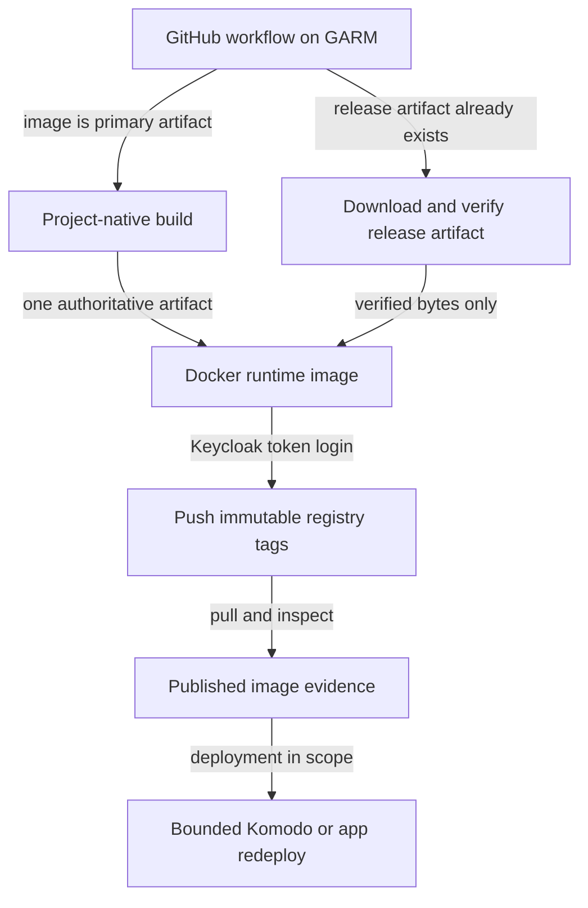
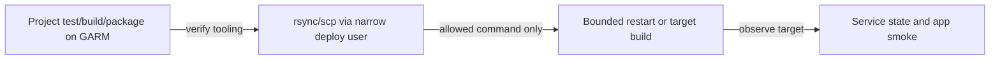
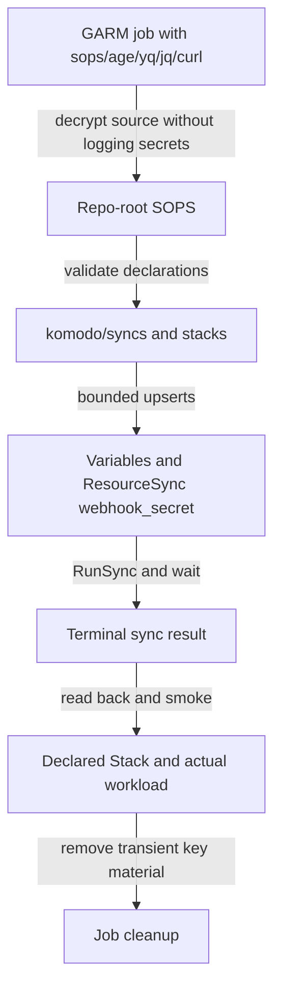

# local-cicd: self-hosted CI/CD 体系

`runner-canary` 是当前 **image-service 样板**，不是所有 GARM 项目的唯一形态。先按项目类型判断，再套对应链路；不要把 registry image、healthz、Komodo DeployStack 强加给 plugin / sync / E2E-only repo。

## Authoritative sources first

Before asserting current state, verify from live/current sources:

1. **Live GARM on VM 181** — repo/pool truth lives in GARM sqlite; read it through the host CLI, whose root profile is restored from SOPS by `pve-vctcn/apps/runner/scripts/login-garm-admin.sh` (see the runner README "GARM administration"):
   ```sh
   ssh root@vctcn-runner.mouriya.lan '/usr/local/bin/garm-cli pool ls --format json'
   ssh root@vctcn-runner.mouriya.lan '/usr/local/bin/garm-cli repository ls --format json'
   ```
   Never print `garm-cli profile list --format json` (it contains the token).
2. **Runner/IaC docs** — `/Users/mouriya/Ext/code/pve-vctcn/apps/runner/README.md` and `/Users/mouriya/Ext/code/pve-vctcn/apps/registry/README.md`.
3. **Consumer repo latest default branch** — fetch/pull latest default branch or inspect `origin/<default>` if the working tree is dirty.
4. **Owning IaC repo** — for placement and install/deploy truth: `homelab-tf` or `pve-vctcn` current docs/state/submodules.

Static lists in this skill are examples/patterns. Treat live GARM + current repo docs as final.

## System boundaries

| Stage | Authority |
|---|---|
| Source repo | App/plugin/sync code, workflow YAML, artifact naming, app-level deploy trigger. |
| Runner seam | One GARM controller on VM 181 `vctcn-runner`, pool state in GARM sqlite (not TF). Each onboarded repo has a resident `lxd_local` pool (LXD on VM 181, mesh via VM 181's NetBird peer) and an edge `incus_edge` pool (Incus on the operator's laptop, mesh via the laptop's peer) with identical labels; the edge takes a job only when the resident pool is full. See `pve-vctcn/apps/runner/README.md`. |
| Private registry | VM 182 `vctcn-registry`, `registry.237575.xyz`, Keycloak `registry` realm, `sa-registry`; maintained by `pve-vctcn/apps/registry`. |
| Homelab deploy | `homelab-tf` owns Core/Periphery, ResourceSync provisioning, VMs/CTs, DNS/mesh/storage; workload repos own repo-backed Stack contents and secrets. |
| vctcn deploy/edge | VM 180 Keycloak/Forgejo, VM 181 runner, VM 182 registry, NPM/DNS/edge under `pve-vctcn`. |

## Decide the CI/CD shape by artifact type

### First decide the build artifact authority

Before writing a Docker workflow, inspect the repo's existing release/build
pipeline and choose exactly one compiler for each released version.

- **Source-built image:** use when the container image is the primary release
  artifact. The Docker build may run the project build once and publish the
  resulting image.
- **Release-artifact image:** use when an existing workflow already publishes
  the executable/package consumed at runtime. That workflow is the sole
  compiler. The image workflow waits for the release artifact, verifies it,
  and only packages it into the runtime image.

Do not rebuild an executable in Docker after its release workflow already compiled it. Verify the release checksum/digest and package those exact bytes; otherwise the same version can name different artifacts.

### A. Image service consumed by Komodo or a host

Use for services like `moat-browser`, `fulcrum`, and the `runner-canary` sample.



Implementation expectations:

- A release-artifact image should trigger only after the artifact is complete
  (`release: published`, a successful upstream workflow, or an equivalent
  explicit dependency), not race a parallel release job on the same tag.
- Keep compilation and packaging separate: the compiler produces the artifact;
  the runtime Dockerfile copies it and installs only runtime dependencies.
- Runner: `runs-on: [self-hosted, linux, vctcn]` plus `netbird` / `vctcn-runner` / `x64` only when the live pool labels require or clarify capability. Labels select the repo's pool pair, not resident vs edge: a job may run on either, so it must not depend on `172.16.1.0/24`, a VM 181 source IP, or the VM 181 image cache.
- Pool: Docker build/push jobs need `flavor=docker` and VM181 helper-generated `extra_specs`, identical on the repo's resident and edge pools.
- Concurrency: a repo can run two GARM jobs at once (one resident, one edge). Every job that writes a shared object (Komodo Stack or Variable, floating image tag, release asset, branch) uses a job-level `concurrency` group named after that object, identical across all workflows that write it, with `cancel-in-progress: false`. Use `queue: max` when each run carries its own intent (a release tag, a version to deploy) that must not be dropped; a workflow that only syncs the current default branch may keep the default single pending run, since the newer run supersedes the older one (mouriya-s-lab/garm-edge-incus#15). actionlint 1.7.12 does not know `queue`; suppress only that diagnostic.
- Registry auth: use `moat-lab/keycloak-token-action@v1` (the old `Mouriya-Emma/keycloak-token-action` spelling still redirects and appears in existing workflows), then `docker login registry.237575.xyz -u sa-registry --password-stdin`.
- Push immutable tags; add convenience tags only when appropriate (`short-sha`, `latest` on main, release tag, PR tag).
- For Komodo delivery, CI may update bounded version/env fields and invoke deployment. Repo-backed durable Stack contents and workload secrets follow Shape D; registry pull authorization, host storage, mesh, Core provisioning, and placement remain IaC responsibilities.
- If the service has HTTP semantics, prefer `/healthz` and `/version`; if not, use an equivalent runtime smoke.

Canonical sample docs:

- `/Users/mouriya/Ext/code/runner-canary/README.md`
- `/Users/mouriya/Ext/code/runner-canary/docs/cicd-template.md`
- `/Users/mouriya/Ext/code/runner-canary/komodo/syncs/stacks.toml`
- `/Users/mouriya/Ext/code/runner-canary/stacks/runner-canary/compose.yaml`

### B. Bounded app-level deploy without registry publish

Use when the target VM builds or runs from rsynced artifacts and the runner only performs a narrow delivery action (example: `nanoclaw`).



Rules:

- Use a narrow deploy user/key and exact allowed sudo commands.
- Do not mutate host placement, DNS, broad packages, storage, or secrets from the app workflow.
- Target-side Docker build is acceptable when that is the app contract; do not force registry publishing just because GARM is involved.
- Evidence is target-side service active/running plus relevant app smoke, not registry pullback.

### C. Release artifact consumed through the owning deployment workflow

Use when an existing authoritative build publishes a release artifact and checksum for a separate consumer.

- Keep that build as the sole compiler; the consumer verifies and uses the published bytes, without rebuilding the same version.
- Choose the consumer and deployment workflow from the actual project contract; this shape does not imply a particular live workload or deployment endpoint.
- Do not force Docker registry publication or Komodo DeployStack. Use IaC only for the scope that actually requires it; normal artifact/version delivery stays with the owning workflow.
- Evidence is the published artifact and checksum plus consumer verification; when deployment is in scope, its owner supplies deployment and runtime evidence.

### D. Komodo ResourceSync / secrets-sync repo

Use for repo-backed homelab workloads such as `homelab-apps`, `homelab-moat`, `moat-browser`, `runner-canary`, and `homelab-trading`, where the owning repo owns Stack declarations, release state, and workload secrets but not VM/Core provisioning.



Rules:

- New Stack compose authority belongs in the owning workload repo (`komodo/syncs/` + `stacks/`), not in `homelab-tf/komodo` file_contents templates.
- No repo-level image build unless an individual stack introduces a custom image contract.
- No VM/Core/Periphery provisioning in the workload repo; that remains in `homelab-tf`.
- Evidence is Variables/ResourceSync API success, terminal `RunSync`, live Stack repo/branch/file path, and real runtime smoke.

### E. GARM-only E2E / notification / runner canary

Use when the repo is not a deployed service, e.g. PR bridge E2E or runner capability checks.

Rules:

- GARM may be required for mesh reachability or parity with production runners.
- No registry, Komodo, or IaC deploy evidence is required unless the workflow actually publishes/deploys something.
- Evidence is the workflow's target behavior (notification sent, bridge template executed, toolchain check passed, canary HTTP/DNS probe passed).

## When GARM/local-cicd is mandatory

Use GARM or a GARM job for any workflow that must:

- reach `*.mouriya.lan`, NetBird peers, homelab services, Komodo, OpenBao, Step-CA, vctcn registry/NPM/edge, or other private endpoints;
- publish to `registry.237575.xyz` from inside the mesh/private path;
- validate production-like nested Docker runner behavior (resident LXD or edge Incus);
- call Komodo APIs without public ingress;
- prove a release/deploy path that is consumed by homelab/vctcn infra.

A repo may mix runner classes by responsibility. Public/cheap tests can run on cloud runners; mesh/publish/deploy/integration jobs should use GARM.

## GARM onboarding / pool shape

Onboarding commands: see `pve-vctcn/apps/runner/README.md` ("GARM 仓 onboarding" and "边缘 Incus provider"). The shape they produce:

1. GARM repository entity with balancer `pack` and a GitHub webhook installed by GARM.
2. A resident `lxd_local` pool (`priority=100`, enabled) with labels matching the workflow `runs-on`.
3. An edge `incus_edge` pool (`priority=0`, image `images:ubuntu/24.04/cloud`) with the same labels, flavor, OS, bootstrap timeout and `extra_specs` as the resident pool. It is created disabled; only the availability gate writes its `enabled` — never pass `--enabled` to an edge pool.
4. Docker build/push or job-container workflows require the Docker-capable pool shape (`flavor=docker`, `runner-bootstrap-timeout=60`, helper `--docker`).

Existing pools are changed live with `garm-cli pool update` on VM 181, applying the same change to both pools of a repo; OpenTofu does not manage repository registrations, pool labels, or `extra_specs`.

Runner environment differences a workflow must tolerate:

- Mesh access comes from the runner host's NetBird peer: VM 181 (LXD bridge NAT) for resident runners, the laptop for edge runners. Edge runners cannot reach vctcn `172.16.1.0/24`.
- `registry-mesh-hosts.sh` in `extra_specs` pins `registry.237575.xyz` to the VM 182 mesh IP on both runner kinds.
- Only resident runners have the `/mnt/docker-images` cache for `catthehacker/ubuntu:act-24.04`; edge runners pull it.
- Edge runner files have no Linux file capabilities (`ping` works through `ping_group_range`); job secrets are decrypted on the laptop; a laptop going offline fails the running job.
- `sops` and `yq` are installed by `binary-tools-install.sh` when requested because Ubuntu apt packages are unsuitable/missing.
- Do not inject old per-runner `netbird-install.sh`.


## CI/CD 与 IaC handoff

已接入的 workload 版本迭代默认由其 repo 的 workflow、`komodo/syncs/`、`stacks/` 完成。Image tag/digest、有界 Variables、RunSync/DeployStack 不需要另开 `iac:deploy`。

出现 host/VM/CT、DNS/mesh/ingress、根信任、GARM pool、Core provisioning，或需 IaC 落地的 secret 配置时，用 `iac-issue-routing` 分清边界。一般执行契约用 `iac-auto-deploy-issue`；首次装配常驻 Komodo CD 用 `iac-cicd-onboarding-issue` 并证明第二次不同版本 rollout；未决设计记录明确 blocker，不触发部署。

Issue 只承接 CI/CD 未覆盖的工作，写清已发布的 artifact 和剩余 IaC 责任；不要让执行 agent 重跑已有自动 build/push/RunSync。

## Evidence matrix

Pick evidence by CI/CD shape:

| Shape | Required evidence |
|---|---|
| Image service | artifact-authority decision; one project build; release checksum/digest match when packaging an existing artifact; Docker build; pushed immutable image; pull/inspect pushed image; GARM job success; deploy/run smoke if deploy in scope. |
| App-level deploy | project tests/build, artifact transfer, bounded remote command output, target service active/running, app smoke. |
| Release artifact consumption | authoritative build/release success; published artifact + checksum; consumer checksum verification; owning deployment workflow and runtime evidence when deployment is in scope. |
| ResourceSync | SOPS decrypt/tooling check, Komodo Variable/ResourceSync API success, `RunSync` accepted/completed, stack smoke if runtime changed. |
| E2E-only/canary | Workflow success plus the behavior being tested; no synthetic registry/deploy evidence. |

PR bodies still follow `writing-pr`. If app and infra are split, say exactly which repo owns each evidence layer and link the owning issue/PR.
