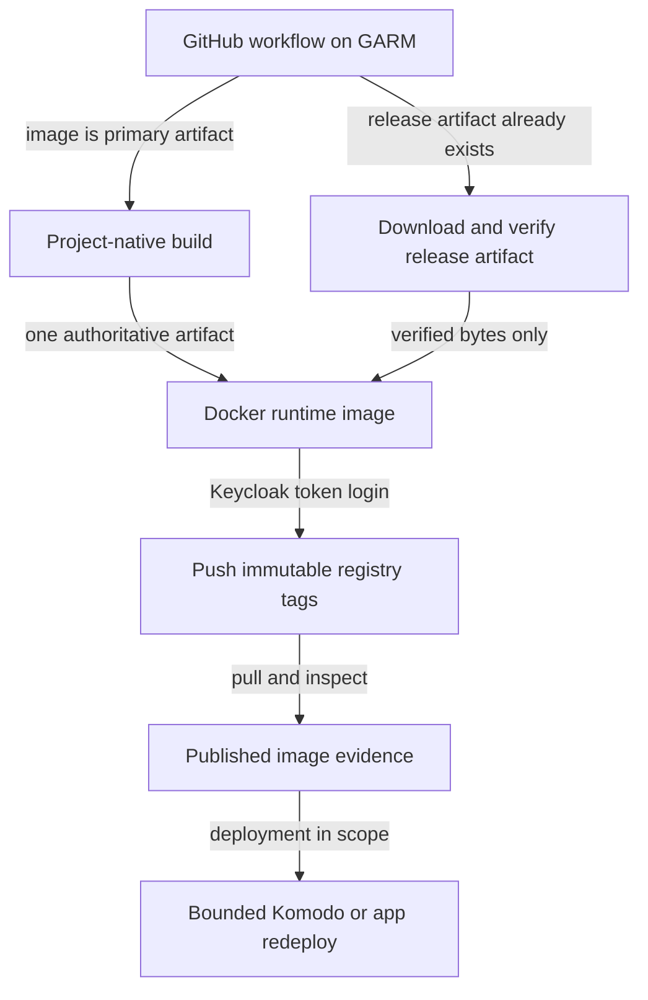

# local-cicd: self-hosted CI/CD 体系

`runner-canary` 是当前 **image-service 样板**，不是所有 GARM 项目的唯一形态。先按项目类型判断，再套对应链路；不要把 registry image、healthz、Komodo DeployStack 强加给 plugin / sync / E2E-only repo。

## Authoritative sources first

Before asserting current state, verify from live/current sources:

1. **Live GARM on VM 181** — repo/pool truth lives in GARM sqlite; read it through the host CLI, whose root profile is restored from SOPS by `pve-vctcn/apps/runner/scripts/login-garm-admin.sh` (see the runner README "GARM administration"):
   ```sh
   ssh root@vctcn-runner.mouriya.lan '/usr/local/bin/garm-cli pool ls --format json'
   ssh root@vctcn-runner.mouriya.lan '/usr/local/bin/garm-cli repository ls --format json'
   ```
   Never print `garm-cli profile list --format json` (it contains the token).
2. **Runner/IaC docs** — `/Users/mouriya/Ext/code/pve-vctcn/apps/runner/README.md` and `/Users/mouriya/Ext/code/pve-vctcn/apps/registry/README.md`.
3. **Consumer repo latest default branch** — fetch/pull latest default branch or inspect `origin/<default>` if the working tree is dirty.
4. **Owning IaC repo** — for placement and install/deploy truth: `homelab-tf` or `pve-vctcn` current docs/state/submodules.

Static lists in this skill are examples/patterns. Treat live GARM + current repo docs as final.

## System boundaries

| Stage | Authority |
|---|---|
| Source repo | App/plugin/sync code, workflow YAML, artifact naming, app-level deploy trigger. |
| Runner seam | One GARM controller on VM 181 `vctcn-runner`, pool state in GARM sqlite (not TF). Each onboarded repo has a resident `lxd_local` pool (LXD on VM 181, mesh via VM 181's NetBird peer) and an edge `incus_edge` pool (Incus on the operator's CachyOS laptop, mesh via that laptop's peer) with the same base labels; a common-label job prefers resident and overflows to edge. An edge pool may additionally carry `cachyos` (pve-vctcn#300), which makes jobs requiring it edge-only. See `pve-vctcn/apps/runner/README.md`. |
| Private registry | VM 182 `vctcn-registry`, `registry.237575.xyz`, Keycloak `registry` realm, `sa-registry`; maintained by `pve-vctcn/apps/registry`. |
| Komodo deploy | Workload repo declarations, webhook and secret workflow, app onboarding: `km` skill. Komodo installation, registry pull account and Core listener ingress: the IaC repo that installs Komodo (`iac-projects`). |
| vctcn deploy/edge | VM 180 Keycloak, VM 181 runner, VM 182 registry, NPM/DNS/edge under `pve-vctcn`. |

## Decide the CI/CD shape by artifact type

### First decide the build artifact authority

Before writing a Docker workflow, inspect the repo's existing release/build
pipeline and choose exactly one compiler for each released version.

- **Source-built image:** use when the container image is the primary release
  artifact. The Docker build may run the project build once and publish the
  resulting image.
- **Release-artifact image:** use when an existing workflow already publishes
  the executable/package consumed at runtime. That workflow is the sole
  compiler. The image workflow waits for the release artifact, verifies it,
  and only packages it into the runtime image.

Do not rebuild an executable in Docker after its release workflow already compiled it. Verify the release checksum/digest and package those exact bytes; otherwise the same version can name different artifacts.

### A. Image service consumed by Komodo or a host

Use for services like `moat-browser`, `paseo`, and the `runner-canary` sample.



Implementation expectations:

- A release-artifact image should trigger only after the artifact is complete
  (`release: published`, a successful upstream workflow, or an equivalent
  explicit dependency), not race a parallel release job on the same tag.
- Keep compilation and packaging separate: the compiler produces the artifact;
  the runtime Dockerfile copies it and installs only runtime dependencies.
- Runner: `runs-on: [self-hosted, linux, vctcn]` plus `netbird` / `vctcn-runner` / `x64` only when the live pool labels require or clarify capability. These base labels select the repo's pool pair, not resident vs edge: a job may run on either, so it must not depend on `172.16.1.0/24`, a VM 181 source IP, or the VM 181 image cache. A job that needs more memory than VM 181's 4 GiB (shared by all resident runners) adds `cachyos`, which only the repo's edge pool carries once the operator adds it there (today only paseo's); that job runs only on the CachyOS edge host and waits while the edge pool is disabled (pve-vctcn#300).
- Pool: Docker build/push jobs need `flavor=docker` and VM181 helper-generated `extra_specs` (`build-extra-specs.sh --docker`), identical on the repo's resident and edge pools. A default-flavor pool (e.g. homelab-moat) has no Docker and no registry pin.
- Concurrency: a repo has capacity for at most one resident and one edge job at a time, and the edge half is conditional: the availability gate must have the edge pool enabled, and the edge Incus project allows only **two instances across all repositories**. Every job that writes a shared object (Komodo Stack or Variable, floating image tag, release asset, branch) uses a job-level `concurrency` group named after that object, identical across all workflows that write it, with `cancel-in-progress: false`. Use `queue: max` when each run carries its own intent (a release tag, a version to deploy) that must not be dropped; a workflow that only syncs the current default branch may keep the default single pending run, since the newer run supersedes the older one (mouriya-s-lab/garm-edge-incus#15). actionlint 1.7.12 does not know `queue`; suppress only that diagnostic.
- Registry push: follow [Private registry](#private-registry-registry237575xyz) below. Naming the token action is not enough; the repo must be onboarded to the registry secret first.
- Push immutable tags; add convenience tags only when appropriate (`short-sha`, `latest` on main, release tag, PR tag).
- Deploying to Komodo: after the image is pushed, the release updates the image reference in the workload repo and pushes; the workload repo's webhook makes km deploy it (`km` skill). Release CI does not edit Komodo resources directly and does not touch host storage, mesh, placement or the target Core's registry account.
- If the service has HTTP semantics, prefer `/healthz` and `/version`; if not, use an equivalent runtime smoke.

Canonical sample docs:

- `/Users/mouriya/Ext/code/runner-canary/README.md`
- `/Users/mouriya/Ext/code/runner-canary/docs/cicd-template.md`
- `/Users/mouriya/Ext/code/runner-canary/komodo/syncs/stacks.toml`
- `/Users/mouriya/Ext/code/runner-canary/stacks/runner-canary/compose.yaml`

### B. Release artifact consumed through the owning deployment workflow

Use when an existing authoritative build publishes a release artifact and checksum for a separate consumer.

- Keep that build as the sole compiler; the consumer verifies and uses the published bytes, without rebuilding the same version.
- Choose the consumer and deployment workflow from the actual project contract; this shape does not imply a particular live workload or deployment endpoint.
- Do not force Docker registry publication or Komodo DeployStack. Normal artifact/version delivery stays with the owning deployment workflow.
- Evidence is the published artifact and checksum plus consumer verification; when deployment is in scope, its owner supplies deployment and runtime evidence.

### C. Komodo workload repo

Use for repos that declare Komodo Stacks (`komodo/syncs/` + `stacks/`), such as `homelab-apps`, `moat-browser-deploy`, `runner-canary` and `homelab-trading`. The repo layout, its ResourceSync, the GitHub webhook to km and the secret workflow are defined in the `km` skill's onboarding section; this skill only covers the CI side of that workflow.

CI rules for the secret workflow:

- It runs on a GARM pool that has `sops`, `yq`, `curl` and `jq` (requested through `--extra-packages`, see below), because it needs mesh access to the Core.
- Decrypt without logging values; write only the Variables the declarations reference; remove the age key and plaintext in an `always()` cleanup step.
- One job-level `concurrency` group per ResourceSync, `cancel-in-progress: false`.
- Evidence is the Variable/ResourceSync API responses, the terminal `RunSync` result, the live Stack repo/branch/file path, and a real runtime smoke of the affected app.

### D. GARM-only E2E / notification / runner canary

Use when the repo is not a deployed service, e.g. PR bridge E2E or runner capability checks.

Rules:

- GARM may be required for mesh reachability or parity with production runners.
- No registry or Komodo deploy evidence is required unless the workflow actually publishes/deploys something.
- Evidence is the workflow's target behavior (notification sent, bridge template executed, toolchain check passed, canary HTTP/DNS probe passed).

## When GARM/local-cicd is mandatory

Use GARM or a GARM job for any workflow that must:

- reach `*.mouriya.lan`, NetBird peers, homelab services, Komodo, OpenBao, Step-CA, vctcn registry/NPM/edge, or other private endpoints;
- publish to `registry.237575.xyz` from inside the mesh/private path;
- validate production-like nested Docker runner behavior (resident LXD or edge Incus);
- call Komodo APIs without public ingress;
- prove a release/deploy path that is consumed by homelab/vctcn infra.

A repo may mix runner classes by responsibility. Public/cheap tests can run on cloud runners; mesh/publish/deploy/integration jobs should use GARM.

## GARM onboarding / pool shape

Onboarding commands: see `pve-vctcn/apps/runner/README.md` ("GARM 仓 onboarding" and "边缘 Incus provider"). The shape they produce:

1. GARM repository entity with balancer `pack` and a GitHub webhook installed by GARM.
2. A resident `lxd_local` pool (`priority=100`, enabled) with labels matching the workflow `runs-on`.
3. An edge `incus_edge` pool (`priority=0`, image `images:ubuntu/24.04/cloud`) with the same base labels, flavor, OS, bootstrap timeout and `extra_specs` as the resident pool; the only intended label difference is an operator-added `cachyos` capability. It is created disabled; only the availability gate writes its `enabled` — never pass `--enabled` to an edge pool.
4. Docker build/push or job-container workflows require the Docker-capable pool shape (`flavor=docker`, `runner-bootstrap-timeout=60`, helper `--docker`).

Existing pools are changed live with `garm-cli pool update` on VM 181, applying the same change to both pools of a repo; OpenTofu does not manage repository registrations, pool labels, or `extra_specs`.

Runner environment differences a workflow must tolerate:

- Mesh access comes from the runner host's NetBird peer: VM 181 (LXD bridge NAT) for resident runners, the CachyOS edge host for edge runners. Edge runners cannot reach vctcn `172.16.1.0/24`.
- In Docker-capable pools, `registry-mesh-hosts.sh` in `extra_specs` pins `registry.237575.xyz` to VM 182's mesh IP on both runner kinds; non-Docker pools get no pin. See [Private registry](#private-registry-registry237575xyz) for what that path implies.
- Only resident runners have the `/mnt/docker-images` cache for `catthehacker/ubuntu:act-24.04`; edge runners pull it.
- Edge runner files have no Linux file capabilities (`ping` works through `ping_group_range`); job secrets are decrypted on the edge host; the edge host going offline fails the running job.
- `sops` and `yq` are installed by `binary-tools-install.sh` only when the pool was built with them requested (`--extra-packages sops,yq,…`; today homelab-apps and homelab-trading). The installer downloads with `curl`, so request `curl` too. Do not assume these tools on other pools.
- Do not inject old per-runner `netbird-install.sh`.

## Private registry (`registry.237575.xyz`)

Owner: `pve-vctcn/apps/registry` (VM 182; Keycloak realm `registry`; docker_auth). Read its README "Authentication flow" before changing anything here.

### How authentication works

The Docker password is a **Keycloak access token**, never the client secret:

1. A token producer runs client_credentials against realm `registry`, client `registry`, and gets an access token whose `aud` includes `registry` (a client audience mapper; Keycloak 26.6.2+ refuses introspection otherwise).
2. `docker login registry.237575.xyz -u sa-registry --password-stdin` with that token. The username must be literally `sa-registry`.
3. On **every** registry token request (each push/pull scope), Docker re-sends that stored token; docker_auth introspects it at Keycloak and, if active, issues a 900-second registry JWT.

So the Keycloak token must still be valid at every push and pull, not just at login. Its effective lifetime is **1800 seconds** today (realm SSO session cap), there is no refresh token, and the action does not renew it. Use the action's `expires-in` output, not a remembered default.

### Onboarding a repo that pushes

GARM onboarding does **not** give a repo registry access. First add the repo to the IaC secret sync in `pve-vctcn/apps/registry/variables.tf` (`registry_consumer_repos_mouriya_s_lab` or `registry_consumer_repos` for moat-lab) and apply that workspace; it writes the Actions secret `KEYCLOAK_REGISTRY_CLIENT_SECRET` and keeps it in sync when the client secret rotates. Never set this secret by hand, never put it in a public repo (public source repos publish through a private deploy repo, as moat-browser does through `moat-browser-deploy`).

Workflow step:

```yaml
- id: registry-token
  uses: moat-lab/keycloak-token-action@v1
  with:
    keycloak-url: https://keycloak.237575.xyz
    realm: registry
    client-id: registry
    client-secret: ${{ secrets.KEYCLOAK_REGISTRY_CLIENT_SECRET }}
- run: printf '%s' "$TOKEN" | docker login registry.237575.xyz -u sa-registry --password-stdin
  env:
    TOKEN: ${{ steps.registry-token.outputs.access-token }}
```

Place the token step **after** the build and immediately before the first push, so login-to-last-push stays well under the token lifetime. A job with several publish phases separated by long work mints and logs in again before each phase. The old spelling `Mouriya-Emma/keycloak-token-action` redirects to the same action; new workflows use `moat-lab/…`.

To check the runner/registry seam without releasing anything, dispatch runner-canary's pull-only canary: `gh workflow run registry-auth.yml -R mouriya-s-lab/runner-canary`. Its `release.yml` is the full publish example.

### Network path from GARM runners

Docker-capable runners resolve `registry.237575.xyz` to VM 182's mesh IP via `/etc/hosts`; VM 182's `registry-mesh-forward` (socat) passes TCP :443 through to NPM, which terminates TLS and routes `/v2/` to the registry and `/auth` to docker_auth. TLS and the `/auth` realm URL are identical to the public path. Outside the mesh (GitHub-hosted runners, off-mesh laptops) the name resolves publicly to the vctcn host; VM 181 resident runners cannot use the public path because OVH does not hairpin.

A push opens a burst of parallel connections at once (roughly one blob HEAD per layer). From the edge host (~180 ms RTT) those handshakes complete together, so the forwarder's listen queue must hold them: with socat's default backlog of 5 the VM 182 kernel reset most of them and edge pushes failed with `connection reset by peer` while auth had already succeeded (pve-vctcn#302, fixed with `backlog=1024`). Lowering `max-concurrent-uploads` does not help, because the HEAD checks are not bounded by it. If that error returns, check the listener first on VM 182: `ss -ltn 'sport = :443'` (Send-Q is the backlog) and `nstat -az TcpExtListenOverflows TcpExtTCPReqQFullDoCookies TcpOutRsts`.

### Pull side (Komodo deploy)

Komodo Periphery never uses a CI runner's login. The target Core's Komodo installation (`homelab-tf/komodo`, role `komodo-registry-account`) maintains a `DockerRegistryAccount` `{domain: registry.237575.xyz, username: sa-registry}` holding a client_credentials access token, re-minted every 15 minutes by the Komodo Action `refresh-registry-237575-token` (shorter than the 1800-second lifetime). The workload's Stack declaration binds it:

```toml
registry_provider = "registry.237575.xyz"
registry_account = "sa-registry"
```

Only the primary homelab Core has this account today. Deploying a private image to another Core (trading included) first needs that Core's Komodo installation to provision the account and refresher (`iac-projects`). Before relying on a pull, check the account exists and the refresher Action's last run succeeded.

### Telling failures apart

| Symptom | Meaning | Where to look |
|---|---|---|
| `unauthorized: Auth failed` at login or on a later push/pull | Keycloak token rejected: expired, wrong secret, missing/unsynced repo secret, or audience/introspection broken | token age vs `expires-in`; repo listed in the IaC sync; docker_auth logs on VM 182; Keycloak `INTROSPECT_TOKEN_ERROR` |
| `denied` / 403 | docker_auth ACL (only `sa-registry` is allowed) | username used at login |
| `connection reset by peer` / EOF to the registry IP | transport, not auth; login and token issuance already succeeded | runner kind (resident vs edge); VM 182 mesh-forward backlog and listen-overflow counters (see Network path); then NPM logs |
| Deploy pull fails, CI pull works | target Core's registry account or refresher | Core `DockerRegistryAccount`, refresher Action history, Stack `registry_account` binding |

## CI/CD 与其他 skill 的分工

- app 的发布与部署（镜像引用更新、Stack 声明、Variable、RunSync）归 workload repo 与 km，见 `km` skill。
- 主机、VM/CT、DNS、mesh、公网入口、根信任、GARM pool 之外的 runner 主机、Komodo 安装，交给 `iac-projects` 定位的 IaC repo；未决设计写清 blocker。
- 给别的 repo 开 issue 时写清已发布的 artifact 和剩余工作；不要让执行方重跑已经自动完成的 build/push/RunSync。

## Evidence matrix

Pick evidence by CI/CD shape:

| Shape | Required evidence |
|---|---|
| Image service | artifact-authority decision; one project build; release checksum/digest match when packaging an existing artifact; Docker build; pushed immutable image; pull/inspect of the pushed digest from the runner; GARM job success; when deploy is in scope, the **target Core's** Compose Pull success for that digest and a run smoke (CI pullback does not prove the target can pull). |
| Release artifact consumption | authoritative build/release success; published artifact + checksum; consumer checksum verification; owning deployment workflow and runtime evidence when deployment is in scope. |
| Komodo workload repo | SOPS decrypt/tooling check, Variable/ResourceSync API success, `RunSync` terminal result, Stack repo/branch/file path, runtime smoke of the affected app. |
| E2E-only/canary | Workflow success plus the behavior being tested; no synthetic registry/deploy evidence. |

PR bodies still follow `writing-pr`. If app and infra are split, say exactly which repo owns each evidence layer and link the owning issue/PR.
